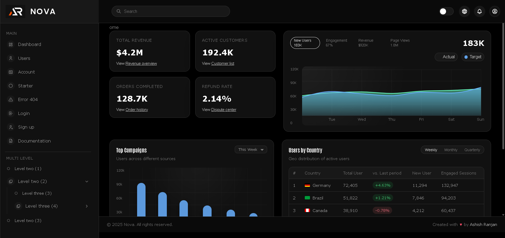
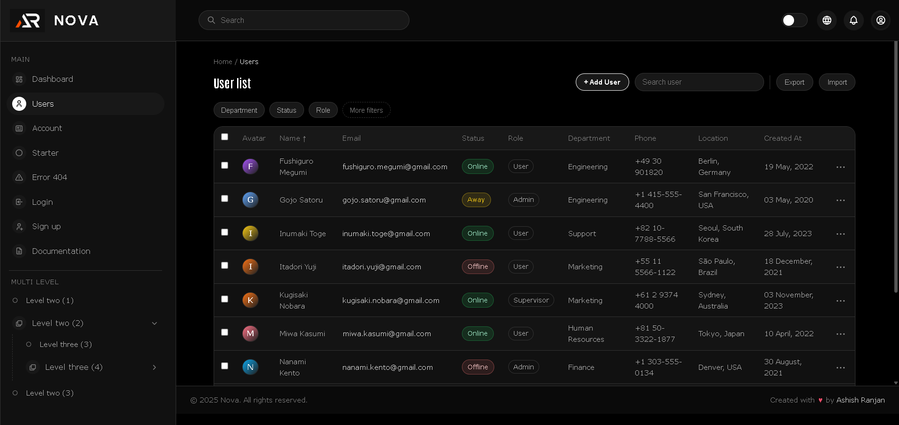
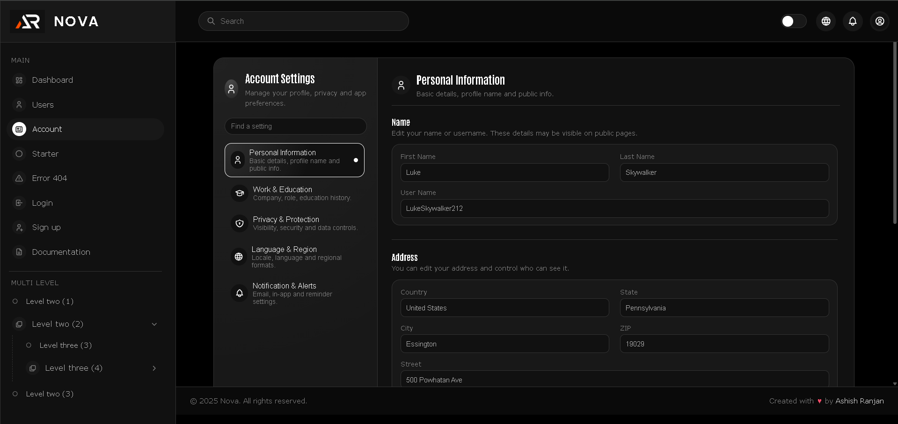
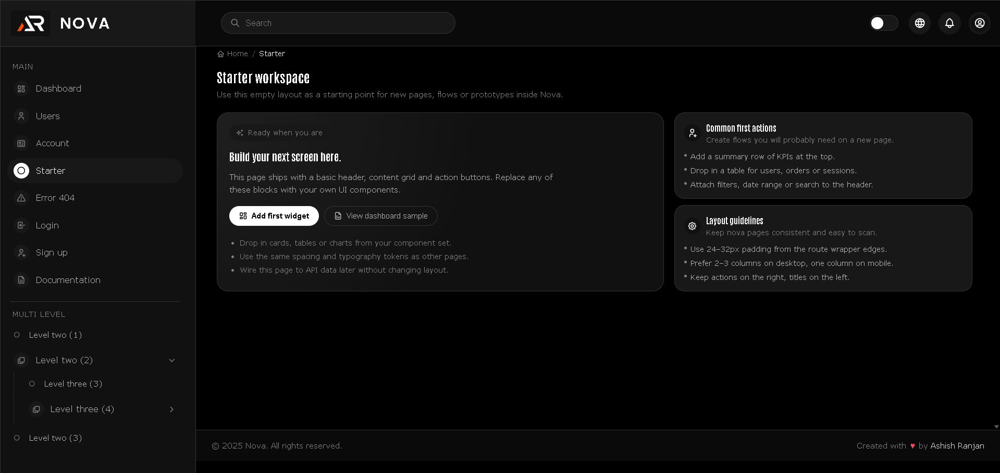
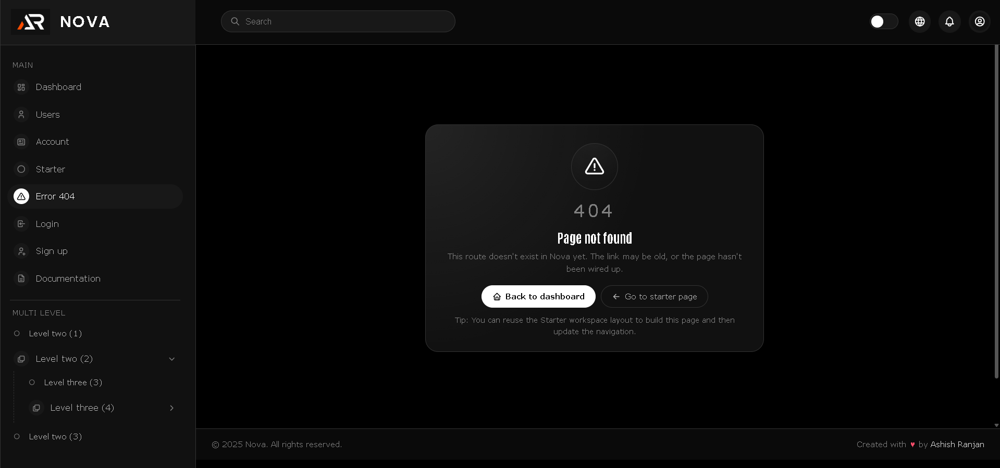
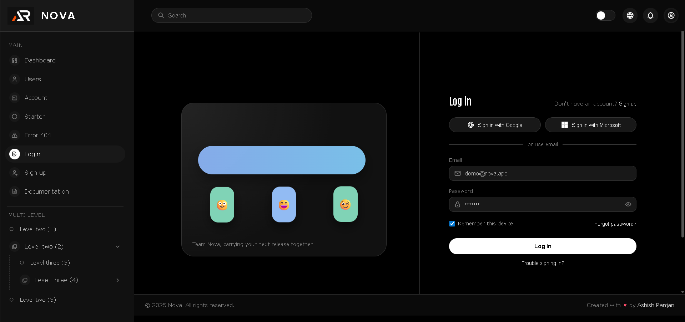
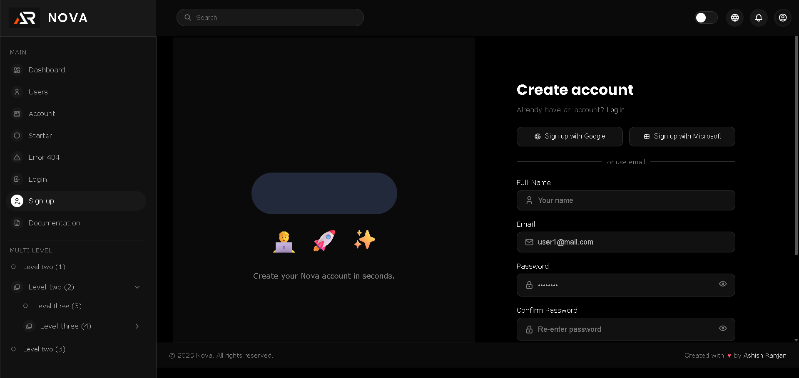
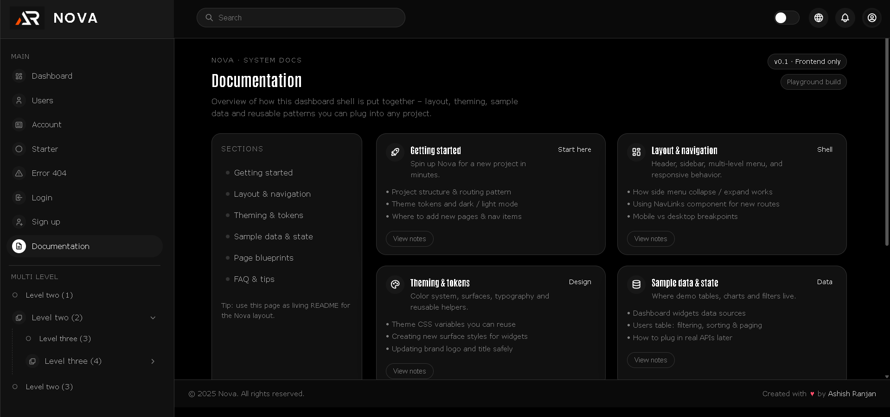

# 🎨 Nova — Modern Admin Dashboard UI (React + Vite)

















Nova is a clean, responsive and highly-interactive **Admin Dashboard UI**, built with modular components, premium interactions, and full light/dark theme support.  
Perfect for SaaS dashboards, analytics panels, internal tools, and enterprise-grade admin systems.

---

## 🔗 Live Demo

**Live Preview:**  
👉 https://a2rp.github.io/nova

**GitHub Repository:**  
👉 https://github.com/a2rp/nova

---

## ✨ Features

-   🌗 Dark + Light Theme (auto-persistent)
-   📊 Smooth animated charts (Recharts)
-   🧭 Multi-level responsive sidebar navigation
-   👤 Login / Signup / Error pages
-   ⚙️ Complete Account Settings with submodules
-   📁 Users table with filters, sort, pagination & dropdown actions
-   🪟 Custom modals & micro-interactions
-   ⚡ Built with React + Vite + styled-components
-   📱 Fully responsive

---

## 🚀 Getting Started

### 1️⃣ Clone the repository

```bash
git clone https://github.com/a2rp/nova.git
cd nova

# Install dependencies
npm install

# Start development server
npm run dev

# Dashboard opens at:
http://localhost:5173/nova
```
