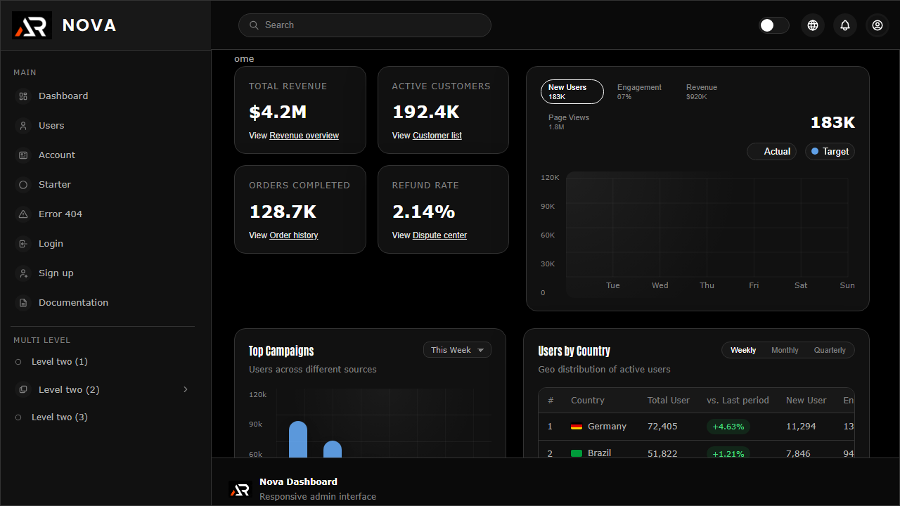

# Nova Admin Dashboard

Nova is a responsive React and Vite admin dashboard interface for analytics, user management, account settings and reusable application screens.



## Features

- Responsive fixed sidebar and header with mobile menu
- Dark and light theme support persisted locally
- Dashboard metrics, charts, campaigns and user views
- Account, login, signup, documentation and error pages
- Independent content scrolling with route-aware loading
- Icon-only social and support links in the footer

## Tech stack

React, Vite, React Router, styled-components, MUI, Recharts, React Icons and React Toastify.

## Run locally

```bash
npm install
npm run dev
```

## Deploy

```bash
npm run build
npm run deploy
```

Live site: [Nova Admin Dashboard](https://a2rp.github.io/nova/)

## Links

- Portfolio: [https://www.ashishranjan.net/](https://www.ashishranjan.net/)
- GitHub: [https://github.com/a2rp](https://github.com/a2rp)
- CodePen: [https://codepen.io/ash1198](https://codepen.io/ash1198)
- LinkedIn: [https://www.linkedin.com/in/aashishranjan](https://www.linkedin.com/in/aashishranjan)
- Facebook: [https://www.facebook.com/theash.ashish/](https://www.facebook.com/theash.ashish/)
- YouTube: [https://www.youtube.com/@ashishranjan-ashz?sub_confirmation=1](https://www.youtube.com/@ashishranjan-ashz?sub_confirmation=1)
- Email: [mailto:ash.ranjan09@gmail.com](mailto:ash.ranjan09@gmail.com)

## Support

- Support: [https://a2rp-donation-page.netlify.app/](https://a2rp-donation-page.netlify.app/)
- Buy Me a Coffee: [https://buymeacoffee.com/a2rp](https://buymeacoffee.com/a2rp)
- Patreon: [https://patreon.com/a2rp](https://patreon.com/a2rp)