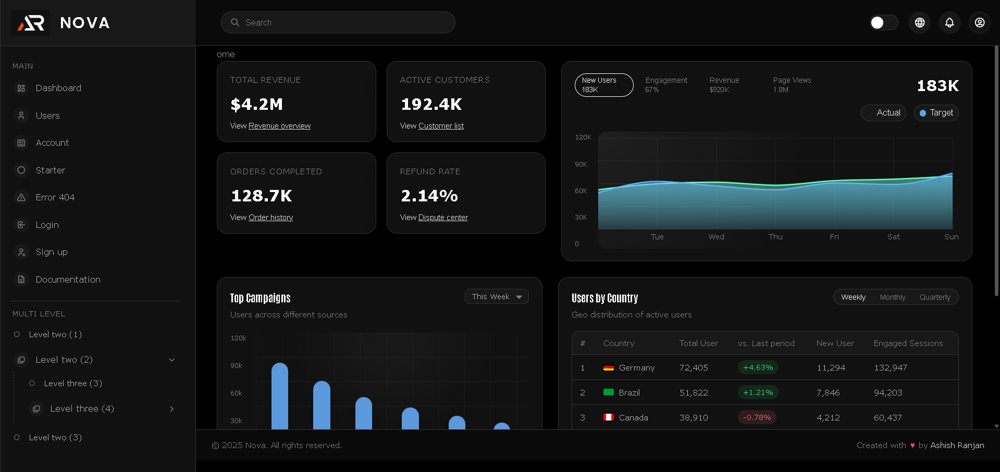
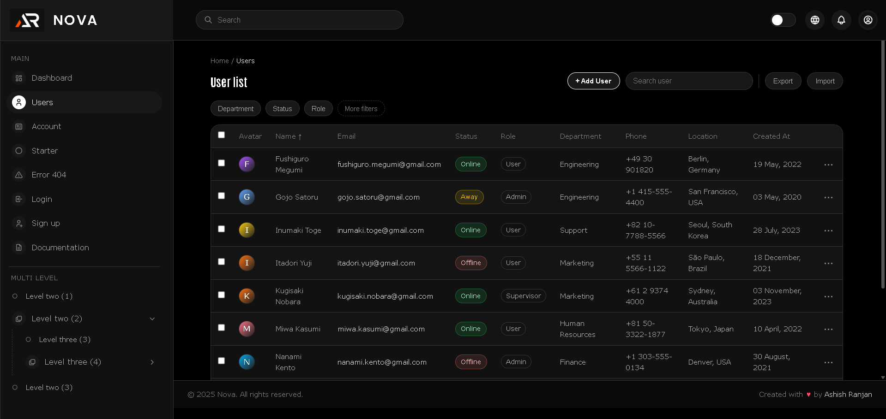
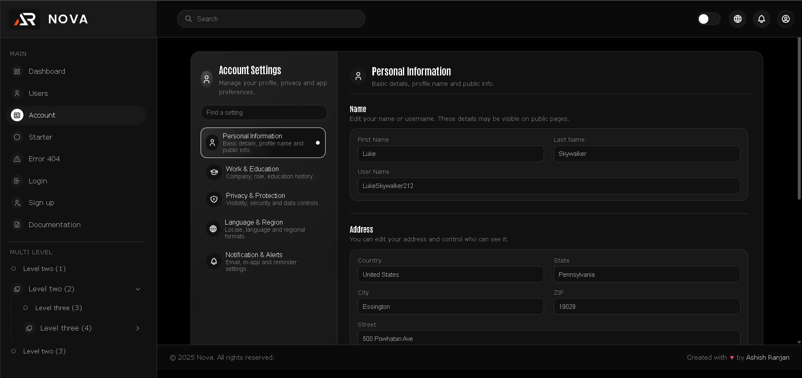
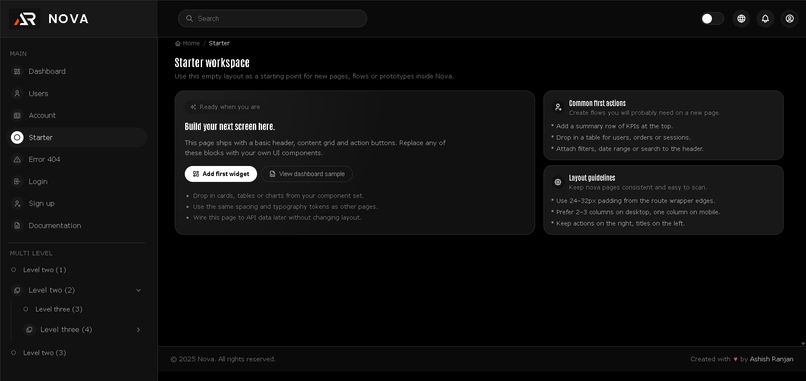
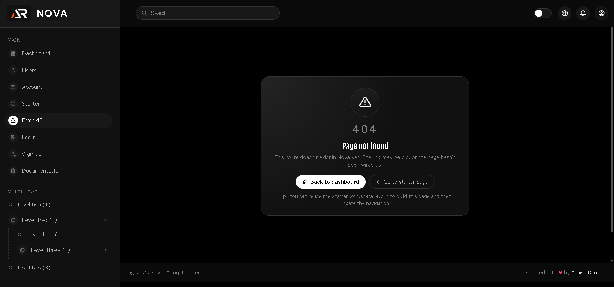
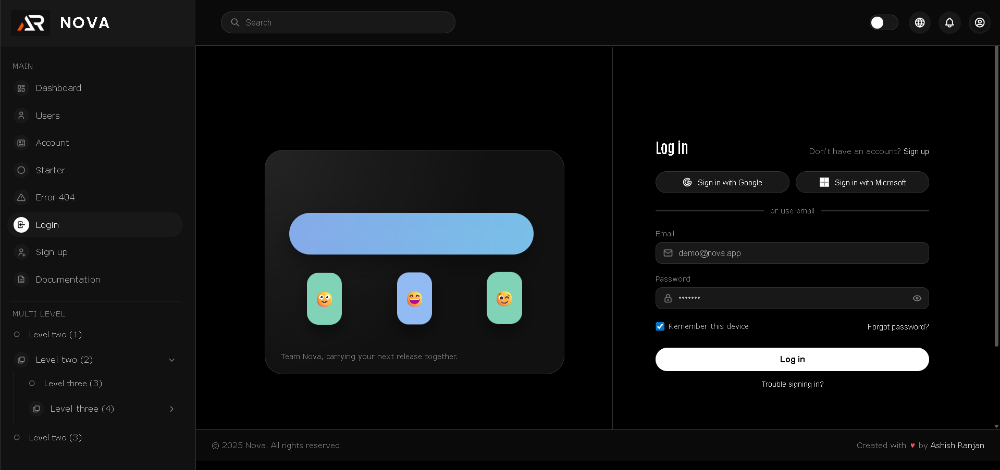
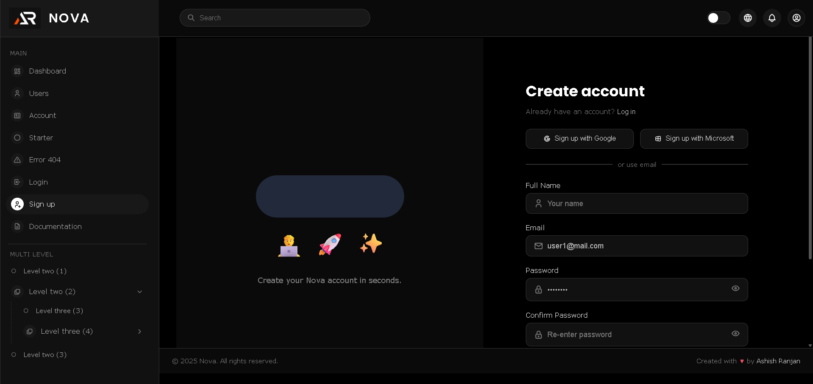
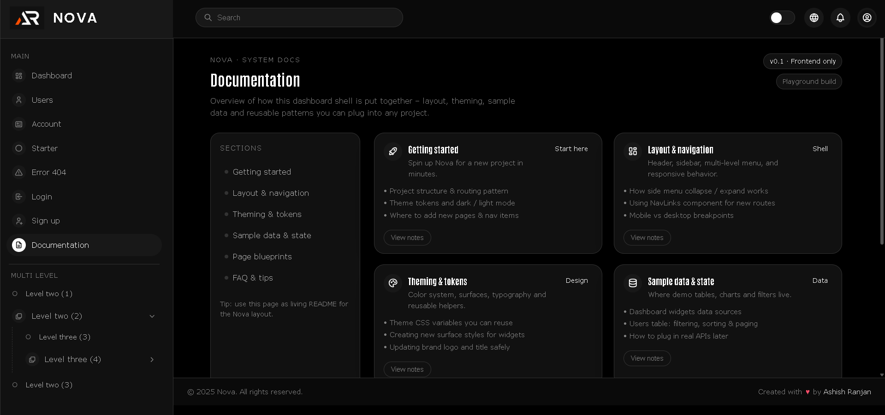

# 🎨 Nova — Modern Admin Dashboard UI (React + Vite)

















Nova is a clean, responsive and highly-interactive **Admin Dashboard UI**, built with modular components, premium interactions, and full light/dark theme support.  
Perfect for SaaS dashboards, analytics panels, internal tools, and enterprise-grade admin systems.

---

## 🔗 Live Demo

**Live Preview:**  
👉 https://a2rp.github.io/nova

**GitHub Repository:**  
👉 https://github.com/a2rp/nova

---

## ✨ Features

-   🌗 Dark + Light Theme (auto-persistent)
-   📊 Smooth animated charts (Recharts)
-   🧭 Multi-level responsive sidebar navigation
-   👤 Login / Signup / Error pages
-   ⚙️ Complete Account Settings with submodules
-   📁 Users table with filters, sort, pagination & dropdown actions
-   🪟 Custom modals & micro-interactions
-   ⚡ Built with React + Vite + styled-components
-   📱 Fully responsive

---

## 🚀 Getting Started

### 1️⃣ Clone the repository

```bash
git clone https://github.com/a2rp/nova.git
cd nova

# Install dependencies
npm install

# Start development server
npm run dev

# Dashboard opens at:
http://localhost:5173/nova
```

## Links

- Portfolio: [https://www.ashishranjan.net](https://www.ashishranjan.net)
- GitHub: [https://github.com/a2rp](https://github.com/a2rp)
- CodePen: [https://codepen.io/ash1198](https://codepen.io/ash1198)
- LinkedIn: [https://www.linkedin.com/in/aashishranjan](https://www.linkedin.com/in/aashishranjan)
- Facebook: [https://www.facebook.com/theash.ashish/](https://www.facebook.com/theash.ashish/)
- YouTube: [https://www.youtube.com/@ashishranjan-ashz?sub_confirmation=1](https://www.youtube.com/@ashishranjan-ashz?sub_confirmation=1)
- Email: [ash.ranjan09@gmail.com](mailto:ash.ranjan09@gmail.com)

## Support

- Support: [https://a2rp-donation-page.netlify.app/](https://a2rp-donation-page.netlify.app/)
- Buy Me A Coffee: [https://buymeacoffee.com/a2rp](https://buymeacoffee.com/a2rp)
- Patreon: [https://patreon.com/a2rp](https://patreon.com/a2rp)
<!-- Project links -->

## Links

- Live: [https://a2rp.github.io/nova/](https://a2rp.github.io/nova/)
- Repository: [https://github.com/a2rp/nova](https://github.com/a2rp/nova)
- Portfolio: [https://www.ashishranjan.net/](https://www.ashishranjan.net/)
- GitHub: [https://github.com/a2rp](https://github.com/a2rp)
- CodePen: [https://codepen.io/ash1198](https://codepen.io/ash1198)
- LinkedIn: [https://www.linkedin.com/in/aashishranjan](https://www.linkedin.com/in/aashishranjan)
- Facebook: [https://www.facebook.com/theash.ashish/](https://www.facebook.com/theash.ashish/)
- YouTube: [https://www.youtube.com/@ashishranjan-ashz?sub_confirmation=1](https://www.youtube.com/@ashishranjan-ashz?sub_confirmation=1)
- Email: [ash.ranjan09@gmail.com](mailto:ash.ranjan09@gmail.com)

## Support

- Support: [https://a2rp-donation-page.netlify.app/](https://a2rp-donation-page.netlify.app/)
- Buy Me a Coffee: [https://buymeacoffee.com/a2rp](https://buymeacoffee.com/a2rp)
- Patreon: [https://www.patreon.com/a2rp](https://www.patreon.com/a2rp)
